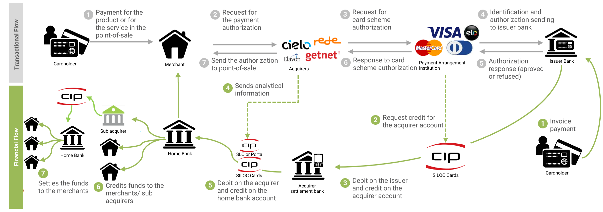
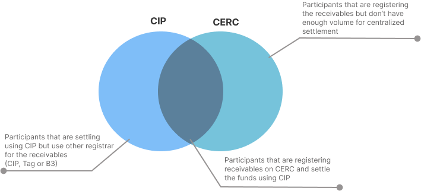

# Sub-acquirers Brazil
Trying to understand better the subacquirers connected with the biggest registrars in Brazil: CERC and CIP.

CIP is also the entity that is responsible for the centralized settlement in Brazil (according to the Circular Letter 3.765):

I started by getting the information about the CERC and CIP SLC participants. When we try to merge those lists we basically have the following scenario:

Let's focus on blue and grey areas. If we consider CIP list, we have columns named 'is_subacquirer' and 'is_subacquirer_receiver'. The second one means that subacquirer receives funds through centralizead settlement chamber, but it doesn't settle using the same chamber to its merchants. We obtain the following combinations after analyzing each subacquirer:

| is_subacquirer| is_subacquirer_receiver|Subacquirer type|
| ----------- | ----------- |------------|
| False      | True       |Since they are only receivers and never reached a trigger to require centralized settlement, they can be consider **recent** subacquirers|
| True      | False       |They started from the beginning being regular subacquirer, so they already had significant volume. We will call the **old** ones|
| True   | True        |We can call them **evolved** subacquirers that started being receivers and the increased their value until convert to regular subacquirers|

# Resources
- [CERC participants list](./input/LISTA-PARTICIPANTES-CERC-ARRANJOS-DE-PAGAMENTO-1.pdf) (updated 05/2022);
- [CIP participants list](./input/ParticipantesHomologados.pdf) (updated 8/11/2022).